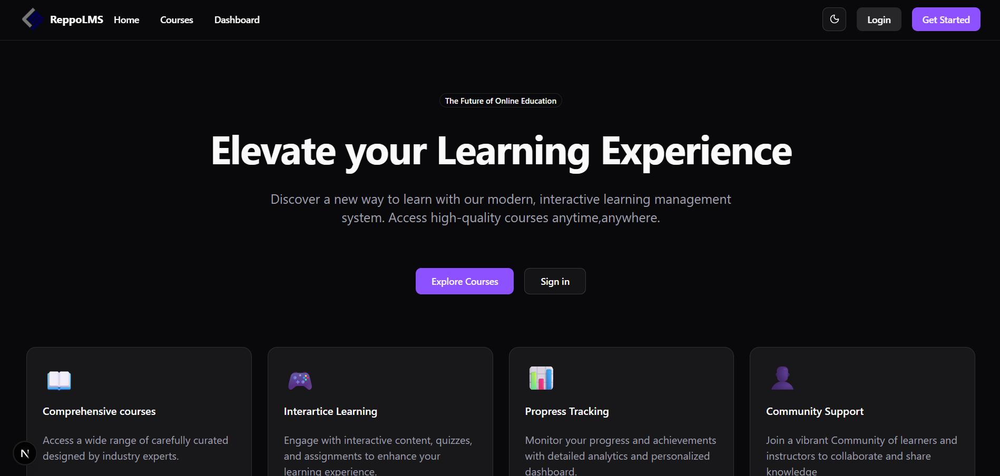
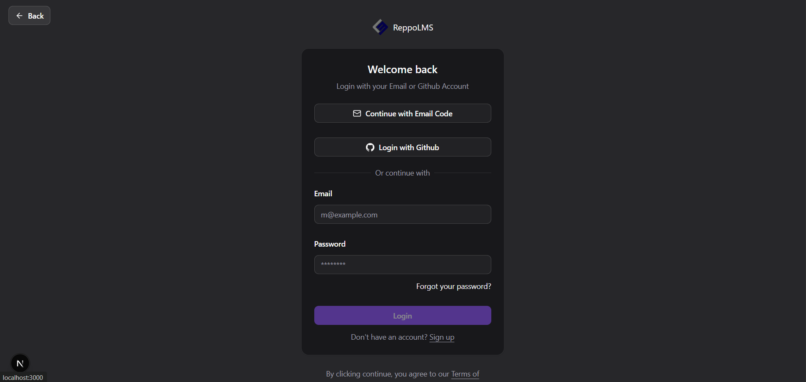
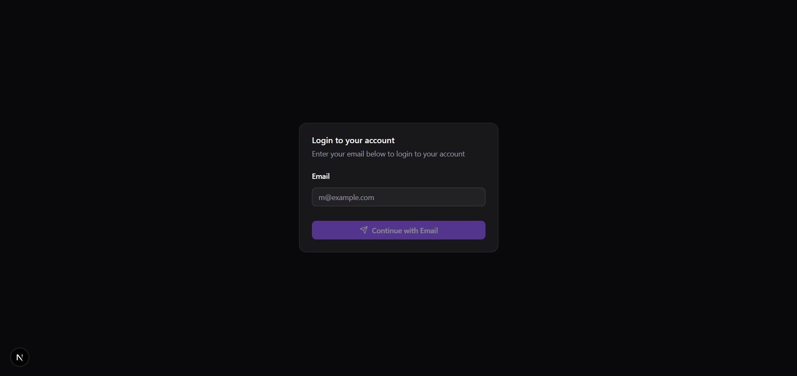
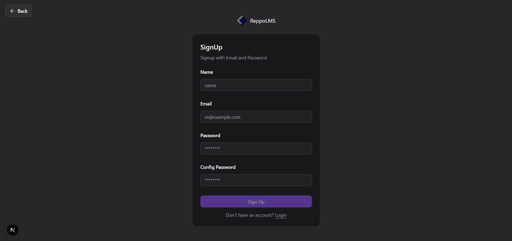
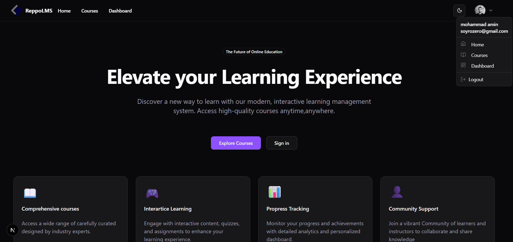
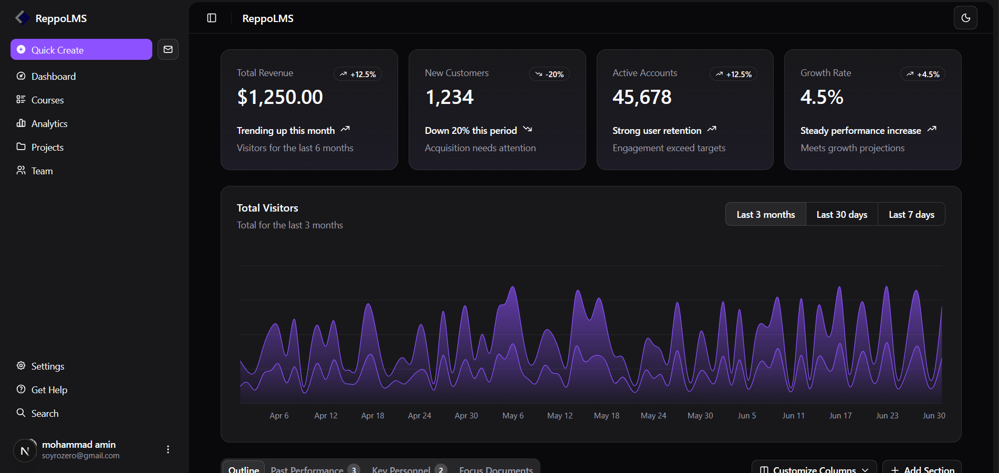
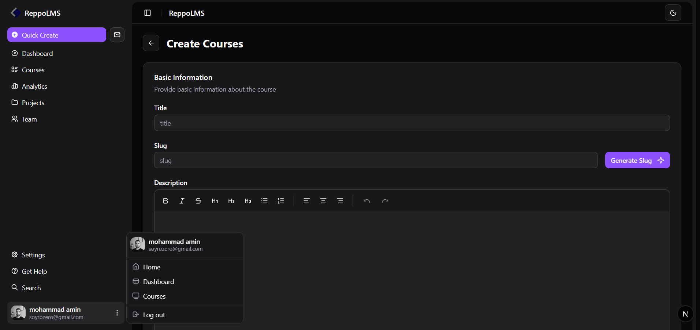
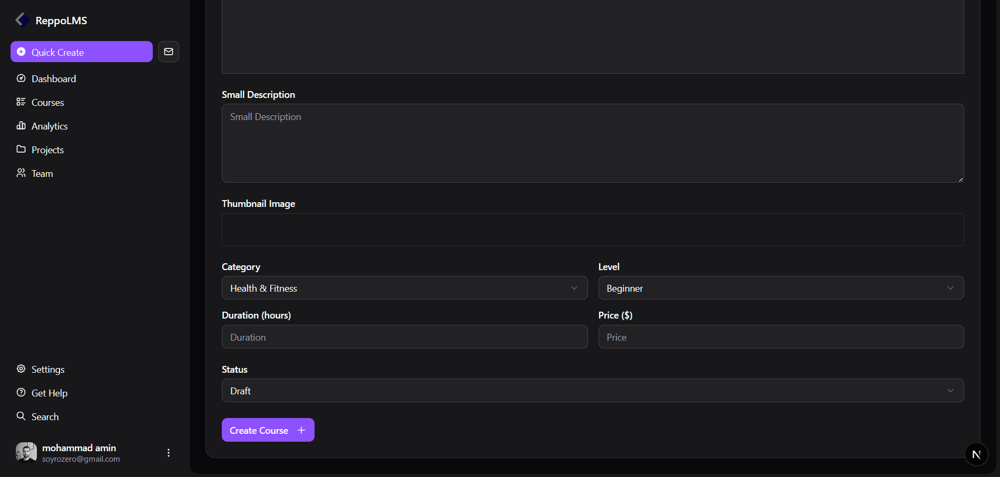

# ReppoLMS — Learning Management System (Next.js)

ReppoLMS is a modern Learning Management System built with **Next.js (App Router)**, featuring a clean UI powered by **shadcn/ui**, secure authentication using **Better Auth**, database management with **Prisma ORM**, and image uploads via **UploadThing**.

---

## ✨ Features

- ✅ Modern Landing / Home Page
- ✅ Authentication System
  - Email & Password
  - Email OTP (used automatically for both **login and signup**)
  - GitHub OAuth
- ✅ User Profile Menu after Login
- ✅ Dashboard (UI-focused / early-stage)
- ✅ Course Creation
  - Course basic information
  - Thumbnail image upload (UploadThing)

---

## 🧰 Tech Stack

- **Next.js** (App Router)
- **TypeScript**
- **Tailwind CSS**
- **shadcn/ui**
- **Better Auth**
- **Prisma ORM**
- **UploadThing** (image upload)

---

## 📸 Screenshots

> Screenshots are located in the `./public` directory.

### Home Page

### Login Page (Email + Password, Email OTP, GitHub)

### Email OTP Flow

### Sign Up (Email & Password)

### Home Page (After Login – User Profile Visible)

### Dashboard

### Create Course

---

## 🔐 Authentication Notes

- Email OTP is handled **automatically** and used for both login and signup.
- Users can authenticate using:
  - Email & Password
  - Email OTP
  - GitHub OAuth
- Authentication is implemented using **Better Auth**.
